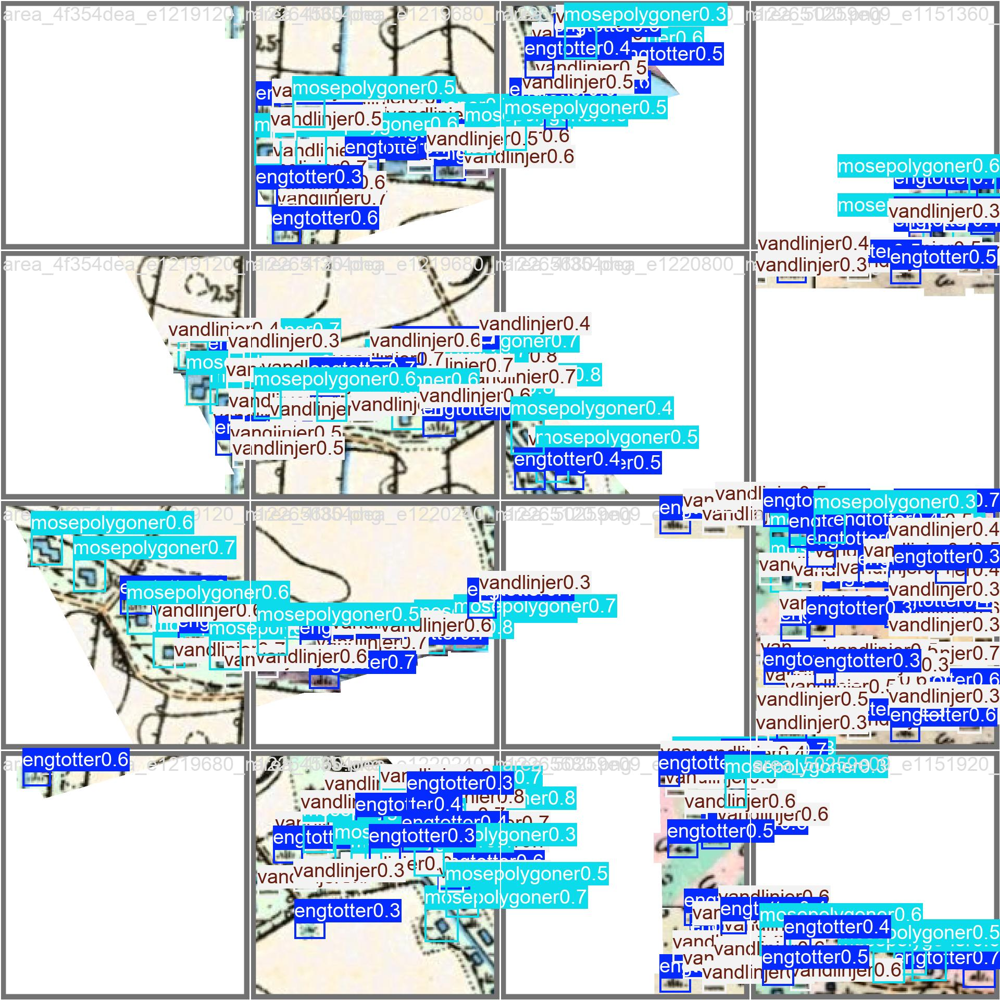
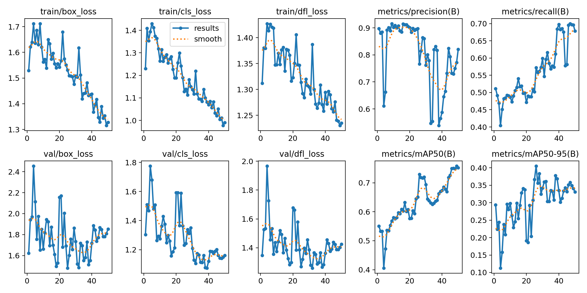
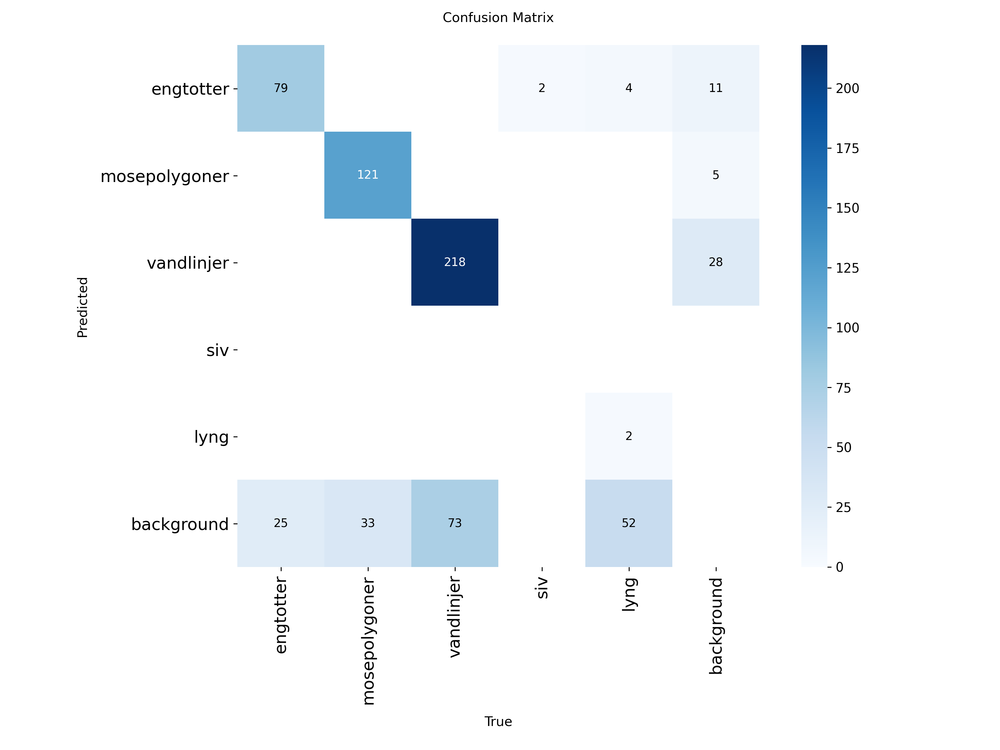

# YOLO object detection for historical Danish maps

This repository contains a reproducible GIS-to-YOLO workflow for detecting
cartographic symbols in Danish historical high-table maps (`Høje
målebordsblade`). It can:

1. create georeferenced image tiles and YOLO labels from reviewed polygons and
   bounding boxes in a GeoPackage;
2. train or fine-tune an Ultralytics YOLO detector;
3. run sliced inference on large images with SAHI; and
4. export unmatched detections to a GeoPackage for review in QGIS.

The included example model detects `engtotter`, `mosepolygoner` and
`vandlinjer`. `siv` and `lyng` are helper classes used to reduce false
`engtotter` detections.



## Repository contents

| Path | Purpose |
| --- | --- |
| `src/danish-historical-map-yolo/prepare_wms_yolo_dataset.py` | Build a masked YOLO dataset from WMS and GeoPackage annotations |
| `../ML_object_detection/src/ML_object_detection/train.py` | Train and validate a YOLO detector (sibling repo) |
| `../ML_object_detection/src/ML_object_detection/infer_with_sahi.py` | Run sliced inference and write LabelMe JSON (sibling repo) |
| `src/danish-historical-map-yolo/export_prediction_candidates_to_gpkg.py` | Export georeferenced predictions for QGIS review |
| `src/danish-historical-map-yolo/geopackage_to_yolo.py` | Convert existing georeferenced GeoTIFF tiles and boxes to YOLO labels |
| `data/annotations/` | Example reviewed areas and source bounding boxes |
| `models/hoje_maalebordsblade_v3.pt` | Included experimental YOLOv8n weights |
| `models/MODEL_CARD.md` | Model purpose, metrics and limitations |

Generated datasets and training runs are excluded from Git.

## Installation

Install [Miniforge](https://github.com/conda-forge/miniforge), open a Miniforge
Prompt, and run from the repository root.

Clone the shared training and inference utilities **next to** this repository
(sibling folder):

```bat
cd ..
git clone https://github.com/SDFIdk/ML_object_detection.git
cd danish-historical-map-yolo
```

On Bash:

```bash
cd ..
git clone https://github.com/SDFIdk/ML_object_detection.git
cd danish-historical-map-yolo
```

Create the conda environment:

```bat
mamba env create -f environment.yml
mamba activate ML_object_detection
```

Check that the main programs load:

```bat
python src\danish-historical-map-yolo\prepare_wms_yolo_dataset.py --help
python ..\ML_object_detection\src\ML_object_detection\train.py --help
python ..\ML_object_detection\src\ML_object_detection\infer_with_sahi.py --help
```

## Input GeoPackage

The dataset generator expects two polygon layers:

- a **reviewed-area layer** defining areas where all relevant objects have been
  annotated; and
- a **bounding-box layer** containing one rectangular polygon per object.

The bounding-box layer must contain a text field with the class name. Layer and
field names are command-line arguments; they are not fixed in the code.

The included example uses:

| Setting | Value |
| --- | --- |
| GeoPackage | `data/annotations/hoje_maalebordsblade_annotations.gpkg` |
| Reviewed areas | `hoje_maalebordsblad_annoteringsomraade` |
| Bounding boxes | `bbox_alle_objekter_v3` |
| Class field | `layer` |
| CRS | `EPSG:25832` |

## 1. Create a YOLO dataset from WMS

The example WMS requires a personal Datafordeler API key. Store it in an
environment variable; never write it in the command, source code or Git:

```bat
set DATAFORDELER_APIKEY=YOUR_OWN_KEY
```

PowerShell uses:

```powershell
$env:DATAFORDELER_APIKEY="YOUR_OWN_KEY"
```

Generate the example dataset:

```bat
python src\danish-historical-map-yolo\prepare_wms_yolo_dataset.py ^
  --gpkg "data\annotations\hoje_maalebordsblade_annotations.gpkg" ^
  --areas-layer "hoje_maalebordsblad_annoteringsomraade" ^
  --boxes-layer "bbox_alle_objekter_v3" ^
  --class-field "layer" ^
  --classes engtotter mosepolygoner vandlinjer siv lyng ^
  --output "data\generated\hoje_maalebordsblade" ^
  --target-crs "EPSG:25832" ^
  --pixel-size 0.5 ^
  --tile-size 640 ^
  --overlap 80 ^
  --val-fraction 0.2 ^
  --seed 4 ^
  --min-area-coverage 1.0 ^
  --mask-outside-areas ^
  --include-edge-object-tiles ^
  --edge-box-padding-pixels 10
```

On Bash, replace `^` with `\` and use
`export DATAFORDELER_APIKEY=YOUR_OWN_KEY`.

The generator writes GeoTIFF tiles (`.tif`):

```text
data/generated/hoje_maalebordsblade/
├── images/train/ and images/val/
├── labels/train/ and labels/val/
├── dataset.yaml
├── generation_config.json
├── tile_manifest.csv
└── generated_tiles.gpkg
```

Pixels outside reviewed areas are white when `--mask-outside-areas` is used.
The optional 10-pixel exception only reveals local context around annotated
boxes that cross an area boundary. `generated_tiles.gpkg` provides a visual
overview in QGIS.

Run `--help` for every option. Use `--dry-run` to inspect the planned split and
class counts without downloading images.

## 2. Train

Start a new model from the standard YOLOv8n checkpoint (from this repo root,
using the sibling training script):

```bat
python ..\ML_object_detection\src\ML_object_detection\train.py ^
  --data "data\generated\hoje_maalebordsblade\dataset.yaml" ^
  --weights yolov8n.pt ^
  --epochs 50 ^
  --imgsz 640 ^
  --device cpu ^
  --name "hoje_maalebordsblade_experiment"
```

Use `--device cuda:0` when a compatible NVIDIA/CUDA installation is available.
The script prints exact `BEST_WEIGHTS=` and `LAST_WEIGHTS=` paths and validates
the best checkpoint after training. Use `best.pt` for later inference.

Training output is written below `runs/detect/` and is ignored by Git.

## 3. Run the included model on large images

```bat
python ..\ML_object_detection\src\ML_object_detection\infer_with_sahi.py ^
  --weights "models\hoje_maalebordsblade_v3.pt" ^
  --folder_with_images "path\to\images" ^
  --result_folder "output\labelme" ^
  --slice_width 640 ^
  --overlap_ratio 0.0625
```

The output is one LabelMe-compatible JSON file per image. This route operates in
image pixel coordinates; it does not itself create GIS geometries.

## 4. Export review candidates to QGIS

For tiles produced by the dataset generator, predictions can be transformed
back to map coordinates using `tile_manifest.csv`:

```bat
python src\danish-historical-map-yolo\export_prediction_candidates_to_gpkg.py ^
  --weights "models\hoje_maalebordsblade_v3.pt" ^
  --images "data\generated\hoje_maalebordsblade\images\val" ^
  --manifest "data\generated\hoje_maalebordsblade\tile_manifest.csv" ^
  --annotations-gpkg "data\annotations\hoje_maalebordsblade_annotations.gpkg" ^
  --annotations-layer "bbox_alle_objekter_v3" ^
  --class-field "layer" ^
  --output "output\prediction_review.gpkg" ^
  --confidence 0.25 ^
  --match-iou 0.20 ^
  --dedupe-iou 0.40 ^
  --device cpu ^
  --overwrite
```

The output contains:

- `all_predictions`: all deduplicated predictions; and
- `candidates`: predictions that do not sufficiently overlap an existing
  annotation.

A candidate is not automatically an error. It may be a false positive, a
missing annotation or a correct prediction whose box differs from the reference
box. Review it in QGIS.

## Example-model results

The included v3 experiment achieved the following validation results for the
three target classes:

| Class | Precision | Recall | mAP50 | mAP50-95 |
| --- | ---: | ---: | ---: | ---: |
| `engtotter` | 0.718 | 0.906 | 0.893 | 0.488 |
| `mosepolygoner` | 0.878 | 0.936 | 0.957 | 0.617 |
| `vandlinjer` | 0.688 | 0.893 | 0.886 | 0.415 |





See [the model card](models/MODEL_CARD.md) before interpreting or reusing the
weights. In particular, `vandlinjer` are simple horizontal line symbols and may
be confused with other linework. The model is an experimental review aid, not
an authoritative map-production result.

## Data, attribution and licences

- Source imagery: Klimadatastyrelsen, `Høje målebordsblade`, accessed through
  Datafordeler.
- Klimadatastyrelsen states that its free geographic data are available under
  [CC BY 4.0](https://www.klimadatastyrelsen.dk/om-klimadatastyrelsen/vilkaar-og-priser);
  retain appropriate attribution when redistributing derived data.
- Source code in this repository is provided under the included MIT licence.
- This project is based on and retains attribution to
  [`SDFIdk/ML_object_detection`](https://github.com/SDFIdk/ML_object_detection).

The repository contains no Datafordeler API key. Each user must supply their
own credentials and comply with the service terms.

## Smoke test

From the repository root, with `ML_object_detection` cloned alongside and a
single `*token.txt` file containing your Datafordeler API key:

```bash
python test.py
```

This runs dataset download, training, inference, and GeoPackage export as
described above.
